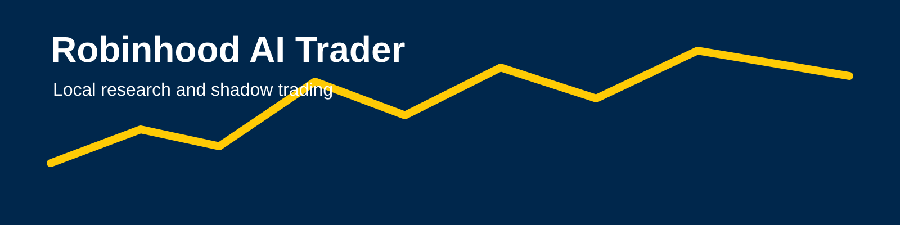
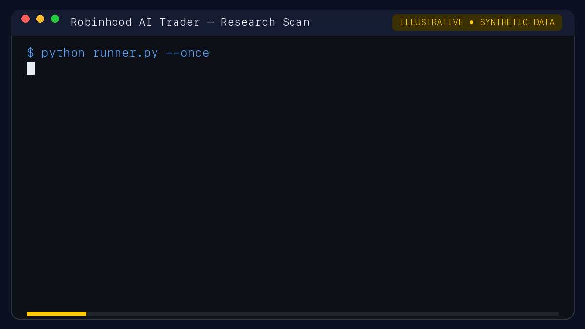
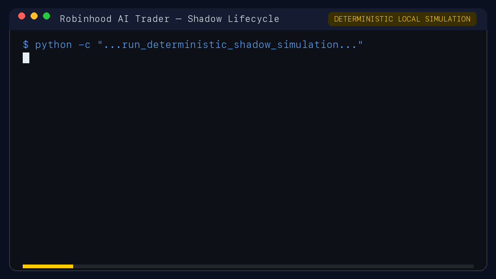

<p align="center">
  
</p>

> **Banner status:** The image above is a clearly marked placeholder. Create a
> final 1600 × 400 px SVG or PNG at `assets/project-banner.svg` that includes
> the project name, a simple market-data motif, and the words “Local Shadow
> Trading.” Do not include account information or imply affiliation with
> Robinhood.

# Robinhood AI Trader

Robinhood AI Trader is a local research and simulated-trading system for
studying intraday U.S. equity strategies with Robinhood market data. It is for
developers and technically curious traders who want an inspectable pipeline:
the project collects factual data, evaluates candidates, applies deterministic
risk rules, and records hypothetical entries and exits in local shadow state.

The project exists to make strategy behavior observable and testable without
turning an AI-generated idea into a real brokerage order. Its current mode is
`SHADOW_TRADING`.

> [!IMPORTANT]
> **This project does not place real Robinhood orders.** Entries, exits,
> positions, cash, and P&L are simulations stored locally. Live execution flags
> are disabled, the local kill switch is blocked, and the runtime does not
> expose an order-submission workflow.

## Table of contents

- [What it does](#what-it-does)
- [Prerequisites](#prerequisites)
- [Installation](#installation)
- [Authorization](#authorization)
- [Quickstart](#quickstart)
- [Example session](#example-session)
- [Demo recordings](#demo-recordings)
- [Architecture](#architecture)
- [Strategies and decision flow](#strategies-and-decision-flow)
- [Safety model](#safety-model)
- [Configuration and local data](#configuration-and-local-data)
- [Useful commands](#useful-commands)
- [Testing](#testing)
- [FAQ](#faq)

## What it does

- **Collects factual market and account context.** The default provider uses
  the Model Context Protocol (MCP) Python SDK to connect to Robinhood, run the
  project-owned `AI_INTRADAY_MOMENTUM_V1` scanner, retrieve quotes and
  five-minute histories, and normalize the results locally.

- **Runs two distinct research strategies.** `POSITION` combines a slower
  research score with fast quote updates. Optional `SCALP` evaluates short,
  deterministic setups without an LLM and remains shadow-only.

- **Separates research from entry timing.** Slow analysis builds candidate
  context. A fast loop polls quotes, updates live scores, and checks freshness,
  spread, geometry, risk, and portfolio limits before any simulated entry.

- **Simulates a complete trade lifecycle locally.** The shadow portfolio tracks
  hypothetical fills, stops, targets, exits, cash, and P&L. It never treats a
  scanner result as an automatic trade.

- **Explains what the runtime is doing.** Normal mode prints a compact dashboard
  with open positions, top candidates, rejection reasons, and the deepest
  current bottleneck. `--debug` retains detailed candidate and funnel traces.

- **Fails closed.** Missing authentication, stale or incomplete data, invalid
  geometry, risk rejection, and market closure are reported as blocks rather
  than being converted into trades.

## Prerequisites

Before running the project, you need:

- Python **3.12 or newer** (`runner.py` rejects older versions);
- a Robinhood account with access to Robinhood Agentic Trading and permission
  to complete its browser consent flow;
- the Codex CLI installed and authenticated for the slow qualitative reasoning
  layer; and
- macOS, Linux, or another environment with a working Python `keyring` backend.
  On macOS, the OAuth material is stored in the login Keychain.

Run all commands from the repository root. No credentials, tokens, account
identifiers, or cookies belong in the repository.

## Installation

Create an isolated environment and install the pinned dependencies:

```bash
cd /path/to/robhinhood-ai-trader
python3.12 -m venv .venv
source .venv/bin/activate
python -m pip install --upgrade pip
python -m pip install -r requirements.txt
```

The core requirements include `mcp==2.2.0`, `jsonschema`, `keyring`, and
`pytest`. The repository also installs the dependencies used by its optional
offline reinforcement-learning research modules.

## Authorization

Authorize this Python application through Robinhood's browser consent flow:

```bash
python runner.py --robinhood-auth
```

The command opens a browser and listens for the OAuth callback on
`127.0.0.1:8765`. It performs authentication only; it does not invoke an order
tool. The application does not reuse browser cookies or store OAuth secrets in
repository files.

Then verify the connection:

```bash
python runner.py --robinhood-mcp-check
```

The check discovers the available safe tool schemas, verifies access to the
Agentic account, and requests one read-only NVDA quote as connectivity
evidence. That quote is not itself a trade signal.

## Quickstart

Run one fresh research cycle:

```bash
python runner.py --once
```

Run the persistent POSITION strategy with the normal terminal dashboard:

```bash
python runner.py --loop
```

Run POSITION and enable SCALP for this process in local shadow mode:

```bash
python runner.py --loop --scalp-shadow
```

Press <kbd>Ctrl</kbd>+<kbd>C</kbd> to stop the loop cleanly. Add `--debug` only
when you need full per-candidate diagnostics:

```bash
python runner.py --loop --scalp-shadow --debug
```

The regular U.S. market must be open for new candidates and simulated entries.
A valid `NO_TRADE` outcome means fresh data was evaluated and no setup passed;
authentication, provider, or stale-data failures are reported separately.

## Example session

The following output is **illustrative**. The symbol and values are synthetic;
they are included to show the dashboard structure, not strategy performance.

```text
$ python runner.py --loop --scalp-shadow
TRADER — SHADOW MODE | SHADOW ONLY | LIVE EXECUTION BLOCKED

TRADER — SHADOW MODE
Time: 2026-09-24T15:02:10+00:00
Market: OPEN
Robinhood: CONNECTED — DIRECT_ROBINHOOD_MCP (REALTIME_FAST)
Safety: SHADOW ONLY — LIVE EXECUTION BLOCKED
Equity: $10000.00  Cash: $10000.00  Open positions: 0
Today P&L: realized=$+0.00 unrealized=$+0.00

POSITION
watching=2 trade-ready=0 open=0 entries=0 exits=0 realized=$+0.00 unrealized=$+0.00
  top candidates:
    ACME score=0.681 watch=0.60 trade=0.72 state=SETUP_FORMING

SCALP
universe=12 fresh=11 classified=4 eligible=1 signal-passes=1 open=0 entries=0 exits=0
  top candidates:
    EXAMPLE MICRO_BREAKOUT score=0.731/0.70 state=BLOCKED
    reason=ENTRY_OVEREXTENDED (price already moved too far to chase)
  bottleneck: scope=ELIGIBLE_CANDIDATE stage=extension_pass
```

The repository also includes a deterministic, network-free lifecycle example:

```bash
python -c 'from event_driven.simulation import run_deterministic_shadow_simulation as run; print(run())'
```

It uses synthetic data to exercise candidate scoring, confirmation, a local
shadow entry and exit, and a separate risk rejection. It performs zero real
order operations.

## Demo recordings

### Demo 1: Research scan — recording required

> **Not yet complete.** Record a silent GIF shorter than 20 seconds and save it
> as `assets/research-scan.gif`. This file does not currently exist. The final
> GIF should show a fresh research cycle reaching scanner results and a concise
> candidate decision without exposing account data.

<!-- After recording, replace this comment with:

-->

### Demo 2: Simulated trade lifecycle — recording required

> **Not yet complete.** Record a silent GIF shorter than 20 seconds and save it
> as `assets/shadow-trade.gif`. This file does not currently exist. The final
> GIF should show a local shadow candidate becoming ready, opening, and closing,
> with “SHADOW” and “LIVE EXECUTION BLOCKED” visible.

<!-- After recording, replace this comment with:

-->

Do not mark the demo requirement complete until both GIF files have been added
and their image lines above have been uncommented.

## Architecture

```mermaid
flowchart LR
    RH[Robinhood Trading MCP<br/>factual data + project scanner]

    subgraph Slow[Slow research path — about every 5 minutes]
        Scan[AI_INTRADAY_MOMENTUM_V1<br/>candidate scan]
        Normalize[Allowlist, normalize, validate<br/>quotes + 5-minute histories]
        Indicators[Deterministic indicators<br/>EMA / RSI / MACD / VWAP]
        Reasoning[Event-gated qualitative<br/>Codex reasoning]
        Coordinator[POSITION coordinator<br/>slow score + hard gates]
        Context[Local CandidateContext<br/>300-second lifetime]
        Scan --> Normalize --> Indicators --> Reasoning --> Coordinator --> Context
    end

    subgraph Fast[Fast quote path — about every 2 seconds]
        Quotes[Batched direct quotes]
        LiveScore[POSITION live score<br/>and age-weighted alpha]
        Scalp[Optional deterministic<br/>SCALP signal engine]
        Confirm[Setup state +<br/>confirmation checks]
        Quotes --> LiveScore --> Confirm
        Quotes --> Scalp --> Confirm
    end

    subgraph Guard[Deterministic entry checks]
        Quality[Fresh quote, market,<br/>spread, and data quality]
        Geometry[Entry, stop, target,<br/>edge, and risk/reward]
        Risk[Position size, buying power,<br/>daily loss, and duplicate limits]
        Quality --> Geometry --> Risk
    end

    subgraph Local[Local shadow execution only]
        Shadow[ShadowExecutor<br/>simulated fill]
        Portfolio[(ShadowPortfolio<br/>local JSON / JSONL)]
        Monitor[FastPositionWatcher<br/>stop / target / time / EOD exits]
        Shadow --> Portfolio --> Monitor --> Portfolio
    end

    RH --> Scan
    RH --> Quotes
    Context --> LiveScore
    Confirm --> Quality
    Risk --> Shadow
    Risk -. rejection .-> Dashboard[Terminal dashboard<br/>reasons + bottleneck]
    Portfolio --> Dashboard
    Shadow -. no broker order .-> Blocked[Real execution blocked]
```



The slow and fast paths share normalized evidence and local state, but they have
different responsibilities. Slow research identifies and contextualizes
candidates. Fast quotes determine whether current conditions still qualify.
Only deterministic quality, geometry, risk, and portfolio checks can reach the
local `ShadowExecutor`.

For implementation-level details, see
[`docs/shadow-runtime-architecture.md`](docs/shadow-runtime-architecture.md) and
[`docs/direct_robinhood_mcp.md`](docs/direct_robinhood_mcp.md).

## Strategies and decision flow

### POSITION

POSITION is the longer-horizon intraday strategy. A slow cycle analyzes up to
10 scanner candidates. Candidates that clear true-hard gates and reach the
`0.60` watch threshold are stored for fast monitoring. The coordinator weights
currently defined in [`config.py`](config.py) are:

```text
0.70 technical + 0.10 news + 0.05 sector + 0.05 market + 0.10 qualitative
```

The fast loop combines that slow score with a deterministic live score based on
spread quality, VWAP and EMA9 state, support/resistance location, and controlled
momentum. A local shadow entry requires a combined score of at least `0.72` for
two consecutive qualifying updates, followed by refreshed geometry, risk, and
portfolio approval.

### SCALP

SCALP is an independent, deterministic short-horizon strategy. It has no LLM
dependency and is disabled by default; `--scalp-shadow` enables it only for the
current loop process. Current gates include a two-second quote-freshness limit,
0.10% maximum spread, 1.20× minimum completed-bar volume expansion, 0.70 signal
threshold, 1.10 minimum risk/reward, and 180-second maximum hold. It remains
local shadow simulation even when enabled.

Candidate appearance never guarantees entry. Both strategies can return no
trade when data or setup quality is insufficient.

## Safety model

The current repository configuration is deliberately fail-closed:

| Control | Current value | Effect |
| --- | --- | --- |
| `MODE` | `SHADOW_TRADING` | Portfolio changes are local simulations. |
| `LIVE_TRADING_ENABLED` | `False` | Live trading is disabled. |
| `ROBINHOOD_EXECUTION_ENABLED` | `False` | Robinhood execution is disabled. |
| Local kill switch | `BLOCKED` | Execution cannot be unblocked by the runtime. |
| Assets | U.S. equities only | No options, crypto, shorting, margin borrowing, or overnight holds. |

The only permitted Robinhood-side mutation is creation, configuration, and
execution of the single saved scanner named `AI_INTRADAY_MOMENTUM_V1`. Account,
position, order, and cash data are otherwise read-only. The project does not
preview, review, place, modify, cancel, or submit real orders in its current
mode.

## Configuration and local data

Primary settings live in [`config.py`](config.py). Frequently referenced
defaults include:

| Setting | Default |
| --- | ---: |
| Slow-cycle target | 300 seconds |
| Fast quote interval | 2 seconds |
| Candidate context lifetime | 300 seconds |
| POSITION watch threshold | 0.60 |
| POSITION entry threshold | 0.72 |
| POSITION confirmations | 2 updates |
| SCALP default | Disabled |
| SCALP signal threshold | 0.70 |
| SCALP maximum hold | 180 seconds |
| Shadow starting capital | $10,000 |

Generated runtime state belongs under `state/`; event and diagnostic output
belongs under `logs/`. Both locations are gitignored because they may contain
private portfolio context. The normalized market snapshot is validated against
[`schemas/market_snapshot.schema.json`](schemas/market_snapshot.schema.json)
before it is atomically replaced.

Never commit generated state, logs, OAuth material, screenshots containing
account details, or terminal recordings with identifiers.

## Useful commands

| Goal | Command |
| --- | --- |
| Run one fresh cycle | `python runner.py --once` |
| Run POSITION continuously | `python runner.py --loop` |
| Run POSITION + shadow SCALP | `python runner.py --loop --scalp-shadow` |
| Show verbose runtime diagnostics | `python runner.py --loop --scalp-shadow --debug` |
| Show readable strategy status | `python runner.py --strategy-status` |
| Show watcher and local position state | `python runner.py --shadow-status` |
| Show local shadow performance summary | `python runner.py --shadow-summary` |
| Inspect one recent SCALP candidate | `python runner.py --scalp-drilldown SYMBOL` |
| Show SCALP configuration/state | `python runner.py --scalp-status` |
| Reset local shadow portfolio state | `python runner.py --reset-shadow` |

`--reset-shadow` asks for an exact interactive confirmation and deletes only
the local shadow portfolio and trade files. It does not contact Robinhood.

## Testing

Run the complete local test suite with:

```bash
python -m pytest -q
```

The tests use temporary portfolios and mocked provider behavior. They cover
authentication boundaries, snapshot normalization, technical indicators,
candidate state, quote freshness, strategy gates, risk limits, shadow fills,
position exits, restart/reconciliation behavior, dashboards, and safety
invariants. They do not contact Robinhood or place orders.

## FAQ

### Is this a live trading bot?

No. The current runner accepts analysis and shadow-trading modes only. All
fills and P&L are local simulations, and real execution remains blocked by
multiple independent controls.

### Why does authorization open a browser?

`python runner.py --robinhood-auth` starts the repository's OAuth/PKCE consent
flow. Complete that once, then use `--robinhood-mcp-check` to diagnose access.
Do not copy tokens or browser cookies into configuration files.

### Why do I see `CODEX_NOT_INSTALLED` or unavailable qualitative reasoning?

The POSITION slow-research layer invokes the local Codex CLI with a
schema-constrained, credential-free payload. Install and authenticate the Codex
CLI, then retry. The fast quote, risk, and position-management paths do not call
the LLM.

### Why did the run report no trade?

`NO_TRADE` is normal when fresh data was evaluated and every setup was rejected.
The dashboard shows the strongest candidates and deepest rejection stage.
Connection, authentication, missing-data, and stale-data problems are reported
as errors instead of `NO_TRADE`.

### Why are candidates not evaluated when the market is closed?

The strategies are regular-session, intraday systems. They stop considering new
entries after the regular U.S. session ends, and overnight positions are not
allowed.

### Why is SCALP disabled?

`SCALP_ENABLED` defaults to `False`. Use
`python runner.py --loop --scalp-shadow` to enable it for one shadow process.
This does not enable real execution or alter the configuration file.

### What does stale quote or stale micro-bar mean?

The provider returned data older than that strategy permits. POSITION and SCALP
have separate freshness requirements; SCALP is intentionally stricter. The
runtime blocks the setup rather than inventing or silently reusing current data.

### What does `OVERLAPPING_RUNNER` mean?

Another process owns the local shadow-state lock. Stop the other runner cleanly
before starting a second one; do not delete the lock while an active process is
using the portfolio.

### Where are results stored?

Local portfolio, candidate, snapshot, and runtime status files are written under
`state/`. Append-only events and diagnostics are written under `logs/`. These
directories are excluded from version control.

### Does the project claim profitable performance?

No. Shadow P&L, backtests, and deterministic simulations are engineering and
research artifacts. They do not establish future profitability and should not
be presented as live trading results.
