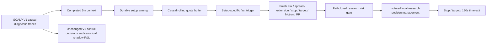

# SCALP V2 / HYBRID_SCALP research evaluation

Date: 2026-09-24  
Mode: `SHADOW_TRADING`  
Status: **experimental; do not promote**

## Executive result

The parallel HYBRID_SCALP research path is implemented and isolated from the
SCALP V1 control. It separates completed-bar context, durable setup arming,
causal quote triggers, current-quote geometry, and local research position
management. It does not own a provider or broker client and does not write to
the canonical shadow portfolio.

The latest session does **not** show that fast quote timing adds predictive
value. All three named symbols had negative median 15/30/60/120/180-second
returns after the modeled spread and slippage. The two independent selected
V2 triggers also lost after costs before geometry; deterministic geometry then
blocked every potential entry. V1's zero-trade outcome was therefore correct
for this session. The evidence is only one six-minute session and is too small
for tuning or promotion.

Artifacts:

- [Replay summary](scalp-v2-replay-2026-09-24.json)
- [Observation timeline](scalp-v2-latest-timeline-2026-09-24.csv)

## Method and causal boundary

The replay selected the latest complete diagnostic session, from
`2026-09-24T19:33:05.419119Z` through `2026-09-24T19:39:18.489555Z` (2,244
observations, 69 episodes). It replayed all 238 V1-eligible AMD, META, and AAPL
observations in chronological order.

Features use only quotes whose exchange timestamps were available at the
observation time. Future bid prices are labels only. A hypothetical fill buys
at the ask plus configured entry slippage and exits at a future bid minus
configured exit slippage. Observation-level labels overlap, so trade metrics
also enforce a 180-second per-symbol cooldown. No result below is a performance
claim.



The current V1 score is recorded as context/setup quality but is not a V2
exact-entry threshold. V1 retains its `0.70` rule.

## 1–6. Forward outcomes and V1 score

Values below are medians in basis points after friction. `N` is eligible
observations; later horizons have fewer labels because the session ends.

| Symbol | N | Median V1 score | 15s | 30s | 60s | 120s | 180s | 180s MFE | 180s MAE |
|---|---:|---:|---:|---:|---:|---:|---:|---:|---:|
| AMD | 96 | 0.507 | -6.59 | -6.67 | -7.23 | -8.18 | -7.07 | -4.20 | -13.43 |
| META | 39 | 0.424 | -9.37 | -10.92 | -11.95 | -16.84 | -23.02 | -6.22 | -23.34 |
| AAPL | 101 | 0.166 | -5.89 | -6.18 | -6.92 | -7.37 | -6.18 | -0.55 | -7.22 |

1. **AMD:** the roughly 0.50-score observations were negative at every median
   horizon, including -7.07 bp at 180 seconds after costs.
2. **META:** the roughly 0.40–0.45 observations deteriorated with time and had
   a -23.02 bp median 180-second result.
3. **AAPL:** the low-score observations were also negative at every median
   horizon; even median MFE remained below the modeled entry cost.
4. **Were the V1 rejections correct?** Yes for this session. No named symbol
   showed positive median opportunity after friction.
5. **Does the V1 score predict outcome?** Not positively in this sample.
   Score/forward-return correlations ranged from -0.27 to -0.35, and every
   populated score bin had negative expectancy. This is observational and
   symbol-confounded, so it does not justify inverting the score. It does show
   that lowering `0.70` would have admitted losing observations here.
6. **Score-bin expectancy:**

| V1 score | Observations | 15s bp | 30s bp | 60s bp | 120s bp | 180s bp | 180s win rate | 180s PF |
|---|---:|---:|---:|---:|---:|---:|---:|---:|
| <.30 | 90 | -5.47 | -5.40 | -5.19 | -6.46 | -6.04 | 0.0% | 0.000 |
| .30–.40 | 10 | -9.58 | -9.49 | -13.79 | -17.88 | -23.98 | 0.0% | 0.000 |
| .40–.50 | 53 | -7.78 | -8.62 | -10.26 | -12.87 | -18.81 | 2.9% | 0.00014 |
| .50–.60 | 82 | -6.51 | -6.20 | -5.85 | -6.86 | -6.35 | 10.5% | 0.00288 |
| .60–.65 | 3 | -12.12 | -17.60 | -16.38 | -23.90 | -23.90 | 0.0% | 0.000 |
| .65–.70 | 0 | — | — | — | — | — | — | — |
| .70–.75 | 0 | — | — | — | — | — | — | — |
| >.75 | 0 | — | — | — | — | — | — | — |

## 7–10. V2 architecture, features, and triggers

7. **Architecture:** `CONTEXT_ACCEPT/NEUTRAL/REJECT` feeds durable armed
   episodes. Once armed, completed 5-minute indicators remain contextual;
   quote-level triggers may fire between bar completions. A trigger immediately
   recomputes ask-side entry, structural stop, target, friction, extension,
   gross RR, and net RR. Research positions then use stop, target, or 180-second
   time exits in separate state and P&L.
8. **Quote features:** exchange timestamp, bid, ask, mid, spread, quote age,
   1/3/5/10/15/30/60-second returns where supported, 5/10/15-second
   acceleration, 30-second realized volatility, velocity, local high/low,
   previous mid, trigger distance, EMA9 distance, and VWAP distance. No quote
   volume is fabricated. Relative SPY/QQQ quote movement was not added because
   the captured traces did not provide sufficiently synchronized benchmark
   quotes.
9. **Trigger variants tested:** breakout cross and retest/reclaim; EMA9
   positive-5s and turn-up; pullback reclaim and turn; VWAP reclaim; and
   momentum acceleration. Selected defaults are setup-specific, not one common
   rule.
10. **Best trigger by setup:** EMA9 turn-up and pullback turn were selected on
    development data, but both were negative in development, validation, and
    holdout. Breakout, VWAP reclaim, and momentum burst had no development
    triggers, so no best variant can be claimed.

| Setup / trigger | Triggered observations | Independent trades | Win rate | Expectancy (bp) | Avg MFE (bp) | Avg MAE (bp) | PF | 60s false breakout |
|---|---:|---:|---:|---:|---:|---:|---:|---:|
| EMA9 positive 5s | 43 | 1 | 0% | -8.34 | -5.64 | -13.75 | 0.0 | 83.8% |
| EMA9 turn-up | 32 | 1 | 0% | -8.34 | -5.64 | -13.75 | 0.0 | 84.6% |
| Pullback reclaim | 1 | 1 | 0% | -9.15 | -3.81 | -10.03 | 0.0 | 100.0% |
| Pullback turn | 18 | 2 | 0% | -13.37 | -3.00 | -14.52 | 0.0 | 93.8% |
| Breakout variants | 0 | 0 | — | — | — | — | — | — |
| VWAP / momentum variants | 0 | 0 | — | — | — | — | — | — |

Triggered-observation counts are serially correlated. Independent-trade rows
are the correct unit for expectancy.

## 11–19. Timing and controlled A/B results

11. **Entry timing:** V1 produced no signal pass or entry. V2 armed four
    episodes and produced 33 selected-trigger observations, representing two
    independent pre-geometry opportunities. All 33 failed current-quote
    geometry, chiefly net RR (33) and gross RR (32), so V2 also produced no
    entry-ready event.
12. **Latency:** armed-to-trigger was 100.19 seconds median, 201.24 seconds p95,
    and 212.71 seconds maximum. Trigger-to-entry-ready is unavailable because
    no trigger passed geometry. In a 10-cycle live shadow integration sample,
    median total cycle time was 541 ms, median V1 work 72.0 ms, median V2 work
    1.67 ms (10.63 ms maximum), and median terminal rendering 0.71 ms.
13. **Net expectancy:** both actual V1 and V2 entry-ready paths had zero trades,
    so realized expectancy is unavailable. For diagnostic comparison only,
    selected V2 triggers before geometry had -8.74 bp expectancy across two
    independent opportunities.
14. **Profit factor:** unavailable for the zero-trade control and actual V2;
    pre-geometry V2 trigger PF was 0.0.
15. **Drawdown:** zero for the zero-trade actual paths; pre-geometry normalized
    cumulative drawdown was 17.48 bp.
16. **Average hold:** unavailable for actual paths; the labeled pre-geometry
    comparison uses the fixed 180-second horizon.
17. **Trades:** V1 control 0; V2 geometry-approved 0; pre-geometry V2 labels 2.
    Because no geometry-approved trade occurred, starting capital and
    portfolio risk limits were never activated; the A/B comparison uses the
    same cost model and chronological observations.
18. **Opportunities missed by V1:** 0 positive independent V2 opportunities.
    A percentage is intentionally not reported because its denominator is zero.
19. **False breakouts:** the selected EMA9 trigger had an 84.6% observation-level
    60-second false-breakout rate; selected pullback reclaim was 100%. These are
    repeated observations, not independent trades.

## 20–27. Data cadence, recommendations, and promotion decision

20. **One-minute data:** the provider exposes intraday one-minute bars under
    interval `minute`. The read-only check returned 5,166 bars for 14 symbols,
    including 29 provider-marked interpolated bars, and supplied completed 1m
    context for all 238 eligible observations. The 1m gate reduced two
    independent pre-geometry triggers to one but retained a loser (-8.34 bp).
    It did not improve this sample and is not yet a live fast-path feed.
21. **Faster polling:** not tested. Source observations were sampled at 1.992
    seconds median (2.141 seconds p95), so 1.0- and 0.5-second behavior cannot
    be reconstructed. Sending new high-rate requests without a provider-budget
    test would not be a controlled experiment.
22. **Recommended polling:** keep the existing 2-second control. In a later
    capacity experiment, poll discovery slowly, armed setups at a capped
    1-second rate, and open positions first. Do not poll the full universe at
    500 ms.
23. **FAST_WATCH:** V2 exposes a dynamic ordered set of open research positions
    followed by armed symbols, and watcher status reports it. It intentionally
    does not reorder or expand V1 provider requests yet, preserving the control.
24. **Parameter changes proposed now:** none. Do not lower the score threshold,
    RR floor, or geometry safeguards. Do not enable faster polling from this
    sample.
25. **Evidence:** all populated score bins were negative; both independent V2
    triggers lost; the 1m gate retained a loser; and current targets were never
    reached within 180 seconds. EMA9 continuation median 180-second MFE/MAE was
    -4.20/-13.43 bp. Micro pullback was -5.26/-22.38 bp, with 0% target reach
    and 59.4% stop breach. This supports retaining the safety gates, not tuning
    them down.
26. **Held-out results:** only 89 observations had full 180-second labels. The
    chronological split was 60/20/20. EMA9 turn-up holdout had one losing trade
    (-0.22 bp); pullback turn had one losing trade (-22.63 bp). Profit factor was
    0.0 for both. This is directionally negative but far too small for a stable
    estimate.
27. **Promotion:** V2 is not ready. It has not shown positive held-out
    expectancy, improved PF, MFE capture, drawdown, or entry timing after costs.

## 28–33. Implementation, verification, and safety

28. **Files changed for V2:**

    - `config.py`
    - `runner.py`
    - `watcher/fast_watcher.py`
    - `trading_runtime/observability.py`
    - `strategies/scalp_v2/__init__.py`
    - `strategies/scalp_v2/research.py`
    - `scripts/scalp_v2_replay.py`
    - `tests/test_scalp_v2.py`
    - the three V2 research artifacts in `docs/`

    Other dirty files in the worktree belong to preceding latency/lifecycle
    work. POSITION files were not changed for this V2 experiment.
29. **Tests added:** causal quote-buffer/no-lookahead behavior; arm then quote
    trigger without mutating a V1 trace; separate V2 state/P&L; and fail-closed
    behavior when the kill switch is unblocked. A fifth test verifies that V2
    applies the deterministic SCALP risk limits to isolated starting capital.
30. **Full suite:** `539 passed in 6.75s` with `python -m pytest -q`.
31. **V1 control:** no existing V1 threshold was changed. In particular,
    `SCALP_MIN_SIGNAL_SCORE` remains `0.70`, and V2 is called only after the V1
    cycle from the same trace output.
32. **Shadow-only safety:** the engine refuses to start unless mode is
    `SHADOW_TRADING`, both live execution flags are false, and the local kill
    switch is blocked. Its state and JSONL events are separate, and its P&L is
    labeled research-only on the dashboard.
33. **Robinhood mutation:** none. The only provider augmentation used for this
    evaluation was read-only historical data retrieval. No order, preview,
    cancel, position, cash, buying-power, transfer, account-setting, or broker
    mutation operation was called.

## Reproduce the offline report

With the local diagnostic and minute-bar cache already present:

```bash
python scripts/scalp_v2_replay.py \
  --start 2026-09-24T19:33:05.419119Z \
  --end 2026-09-24T19:39:18.489555Z \
  --timeline docs/scalp-v2-latest-timeline-2026-09-24.csv \
  --summary docs/scalp-v2-replay-2026-09-24.json \
  --minute-cache state/scalp_v2_minute_bars_2026-09-24.json
```

This is an offline research replay. It does not place or simulate a Robinhood
broker order.
